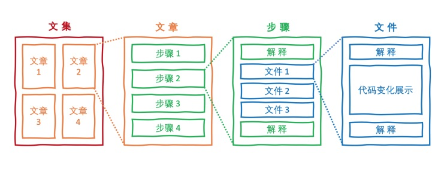

# 图雀写作工具

该项目是图雀写作工具的编辑界面源代码，主要功能是为用户提供一个简单、美观、易用的界面来基于 Git 仓库编写实战教程。

## 基本概念



- **文集**：写作工具进行编辑的基本单位，保存在一个 JSON 文件中，在编辑时会进行同步保存
- **文章**：一个文集可以包含多篇文章
- **步骤**：一个步骤对应一次 Git 提交记录，并且一个文章包含一个或多个步骤
- **文件**：一个文件对应一次提交中修改的文件，并且一个步骤包含一个或多个文件

## 项目结构

该项目是使用 [Create React App](https://create-react-app.dev/)（CRA）脚手架创建的项目，最外层的组织结构如下：

- `src` 是项目的前端 React 源代码
- `public` 是静态资源文件，由 CRA 默认生成，并做了细微调整
- `screenshots` 存放了项目的界面截图
- `server.js` 是一个简易版本的本地服务器，实现了文集、Diff 数据的获取，以及保存的 API

### 前端 React 代码

前端代码都在 `src` 目录下。由于使用了 [React Router](https://github.com/ReactTraining/react-router) 来实现前端路由，并使用 [Rematch](https://github.com/rematch/rematch) 实现状态管理，因此项目布局上也会反映出来：

- `assets` 包含了所有的静态资源文件
- `components` 包含了可复用的 React 组件
  - `ConnectedLayout`：页面共享布局组件
  - `ArticleCatalogue`：文章目录组件
  - `ArticleContent`：文章正文组件
  - `DrawerComponent`：抽屉组件
  - `MainMenu`：菜单组件
  - `StepFileList`：步骤文件列表组件
- `models` 包含了 Rematch 数据模型
  - `collection.js`：教程数据模型
  - `diff.js`：Git Diff 数据模型
  - `drawer.js`：抽屉组件的状态模型
- `pages` 包含了前端路由的子页面
  - `Home.js`：文集首页
  - `Article.js`：文章详情页面
- `constants.js` 是项目用到的一些常量
- `index.js` 是 React 的渲染入口文件
- `store.js` 是 Rematch 的中心状态 Store
- `utils.js` 是项目的辅助函数模块

### 后端服务器接口

后端服务器主要定义了以下接口：

- `GET /collection`：用于获取文集数据
- `GET /diff`：用于获取 Git Diff 数据
- `POST /save`：用于保存文集数据

## 如何运行项目

运行项目只需使用常规的 npm 命令即可：

```bash
npm install & npm start
```

随后会同时运行本地服务器（默认在 `localhost:5000`），并且 CRA 的开发服务器也会自动在浏览器打开编辑器前端界面（默认在 `localhost:3000`），并将前端发起的所有请求代理到本地服务器。
